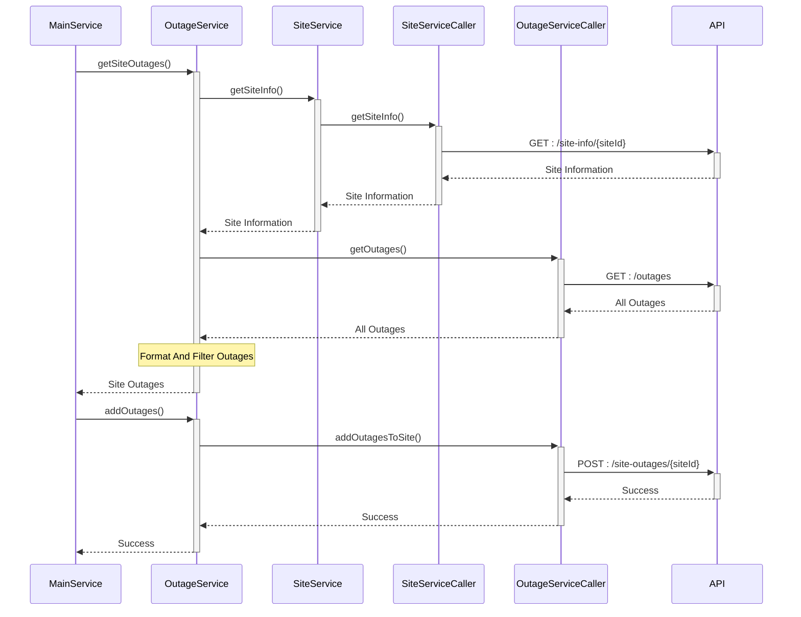

# KrakenFlex Backend Task :octopus:

## Introduction :scroll:

Welcome!

This small program will retrieve all outages for a site. It will then filter out any outages that began before a specific date or don't have an ID that is in the list of devices in the site information. For the remaining outages, it will attach the display name of the device in the site information to each appropriate outage and send this list of outages to the appropriate endpoint for the site with the ID of the selected site. Let's get started!

### Sequence Diagram of General Flow


### Requirements :spiral_notepad:
  - Node Version : v14.x
  - npm Version : 6.14.x
  - yarn Version : 1.22.x
#### Installing Dependencies
 
With `npm`
```bash
npm install
```
---
With `yarn`

```bash
yarn
```
  

#### Running Tests :pencil2:
***For all tests***
```bash
npm run test
```
or
```bash
yarn test
```
***
***For unit tests***
```bash
npm run test:unit
```
or
```bash
yarn test:unit
```
***
***For  E2E tests***
```bash
npm run test:e2e
```
or
```bash
yarn test:e2e
```
### How To Run :computer:

  

#### Environment Variables
| Variable | Type  | Decription   |
|--|--|--|
| API_KEY | String  | When calling KrakenFlex API, to set `x-api-key` |
| SERVICE_URL | String  | KrakenFlex API URL, it must be started with `http://` or `https://` |
| LIMIT_DATE | String | To filter all outage records after the date |
| SPECIFIC_SITE_ID | String | To get outage data of a specific site  |
| RETRY_ATTEMPS | Number | How many times to retry when API returns `HTTP 500 Internal Server` |
| RETRY_INTERVAL | Number  | How many often to retry when API returns `HTTP 500 Internal Server`, milliseconds |

**Example .env File**
```
API_KEY=example_api_key
SERVICE_URL=https://api.my-service.com/
LIMIT_DATE=2022-01-01T00:00:00.000Z
SPECIFIC_SITE_ID=example-site-id
RETRY_ATTEMPS=5
RETRY_INTERVAL=5000
```
#### Run

```bash
npm run start
```
or
```bash
yarn run start
```
  

##### Example Console Output

```bash
info: Site (*****-****-tree)
info: Battery 1 (111183e7-****-436b-9951-************) - 2022-01-01T00:00:00.000Z -> 2022-09-15T19:45:10.341Z
info: Battery 1 (111183e7-****-436b-9951-************) - 2022-02-18T01:01:20.142Z -> 2022-08-15T14:34:50.366Z
info: Battery 2 (86b5c819-****-4978-8c51-************) - 2022-02-16T07:01:50.149Z -> 2022-10-03T07:46:31.410Z
info: Battery 2 (86b5c819-****-4978-8c51-************) - 2022-05-09T04:47:25.211Z -> 2022-12-02T18:37:16.039Z
info: Battery 3 (70656668-****-49fa-be2e-************) - 2022-04-08T16:29:22.128Z -> 2022-06-09T22:10:59.718Z
info: Battery 4 (9ed11921-****-40f4-be66-************) - 2022-01-12T08:11:21.333Z -> 2022-12-13T07:20:57.984Z
info: Battery 5 (a79fe094-****-4b1e-ae20-************) - 2022-02-23T11:33:58.552Z -> 2022-12-16T00:52:16.126Z
info: Battery 6 (0e4d59ba-****-4451-a8ac-************) - 2022-02-15T11:28:26.735Z -> 2022-08-28T03:37:48.568Z
info: Battery 7 (20f6e664-****-4621-9ca4-************) - 2022-02-15T11:28:26.965Z -> 2023-12-24T14:20:37.532Z
info: Battery 8 (75e96db4-****-4035-8f43-************) - 2023-05-11T14:35:15.359Z -> 2023-12-27T11:19:19.393Z
info: Outages has been added
```
> Some values are masked
---
**Example Error Console Output**
```bash
error: SiteId is Empty
```
